# 🍽️ Makani

تطبيق مطعم تفاعلي باستخدام Flutter يسمح بتصفح قائمة الطعام، إضافة الطلبات للسلة، وتتبع الطلبات.

## 🚀 الخصائص الرئيسية

- تسجيل دخول وتسجيل مستخدم جديد
- تصفح قائمة الطعام
- إضافة أطباق إلى السلة وإتمام الطلب
- تتبع حالة الطلب
- إشعارات فورية (Push Notifications)
- واجهة استخدام متجاوبة وسهلة
- تكامل مع Firebase (لإدارة المنتجات، الطلبات، والمستخدمين)
- أداء عالي بفضل تطبيق أفضل ممارسات Flutter

## 📦 التقنيات والحزم المستخدمة

- Flutter SDK
- Firebase Auth, Firestore, Messaging
- Provider أو Riverpod أو Bloc
- وغيرها...

## 📸 لقطات شاشة

### الشاشة الرئيسية
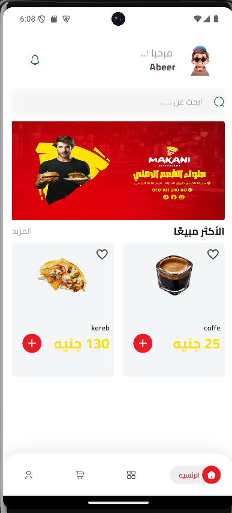

### البحث
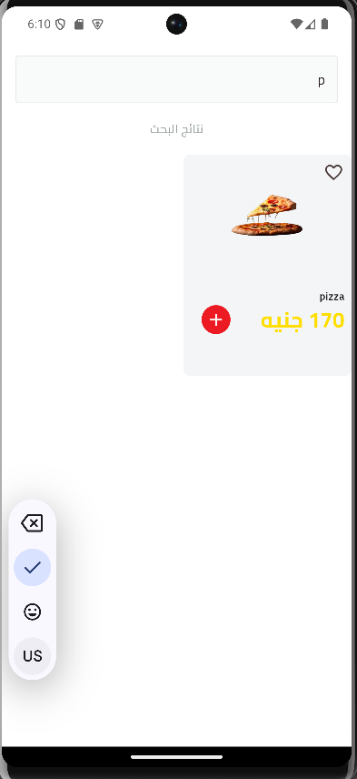

### السلة
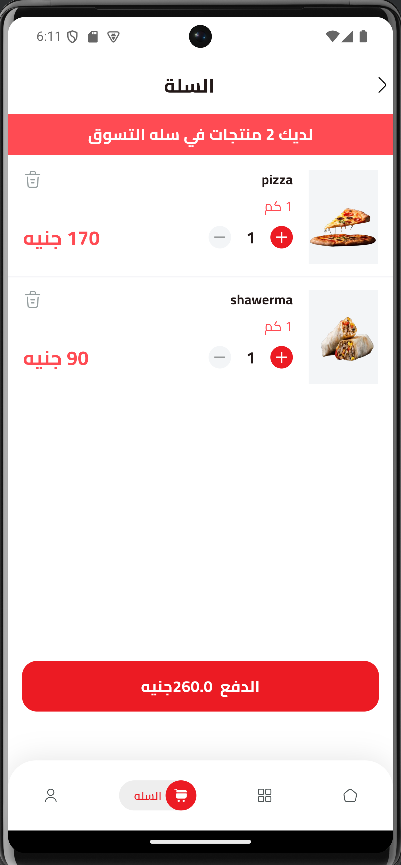

### الدفع
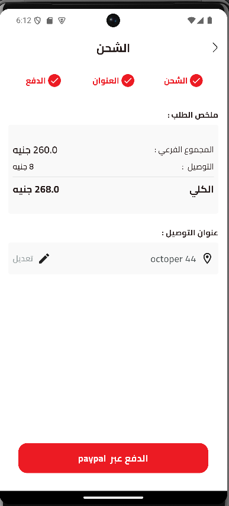

### المنتج
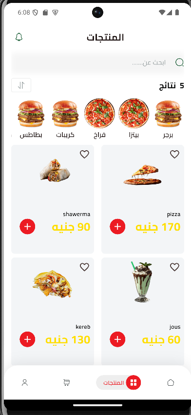

### العروض

### الفلترة

### تسجيل الدخول
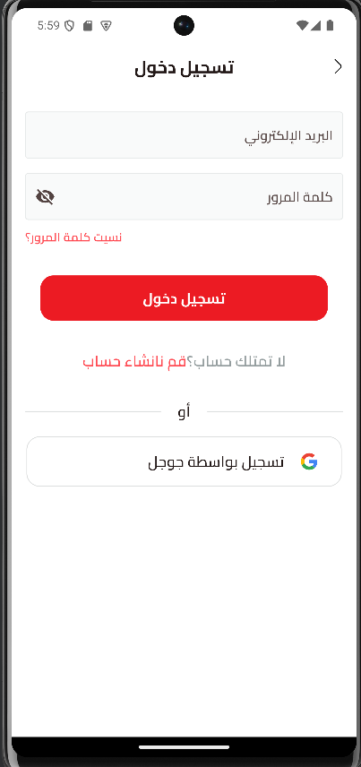

### تسجيل الخروج
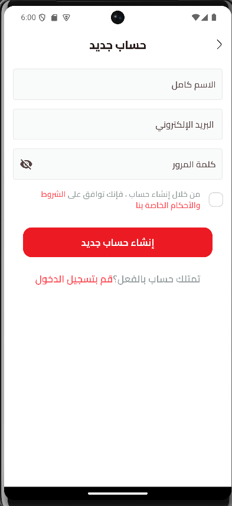

### نسيت كلمة المرور

### شاشة البداية (Onboarding)
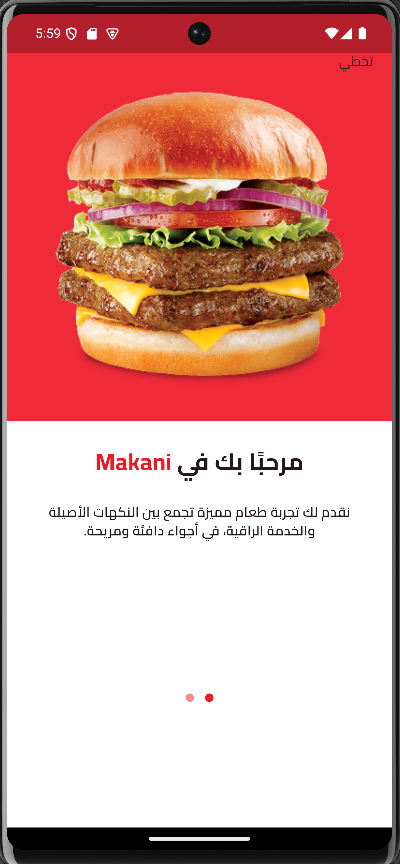

### العنوان
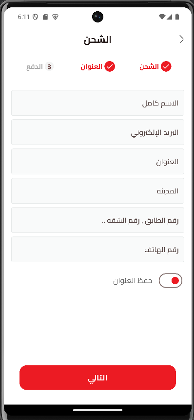

### الشحن
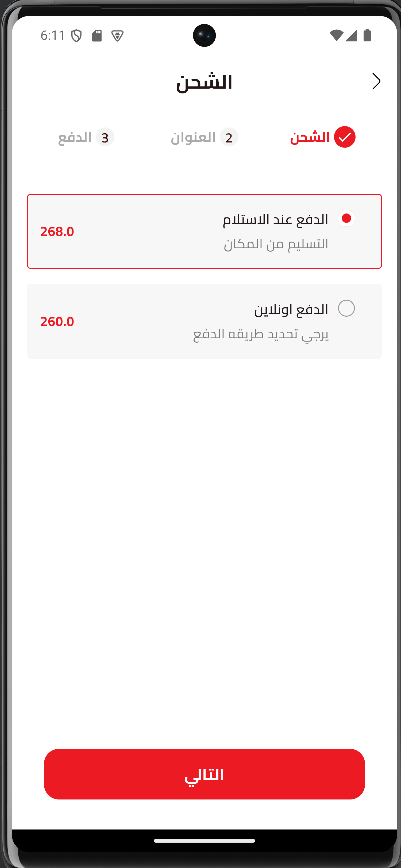

### عرض الوجبة
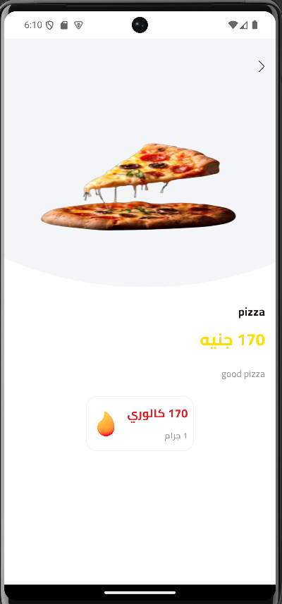
